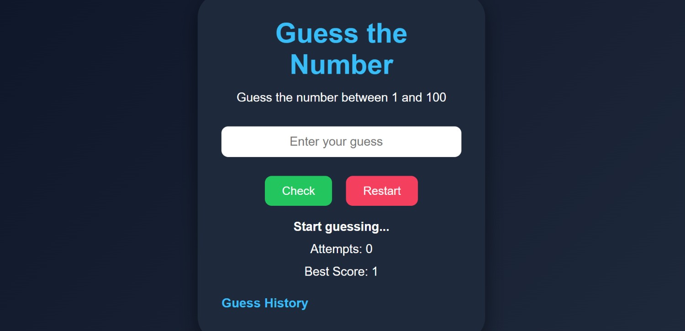
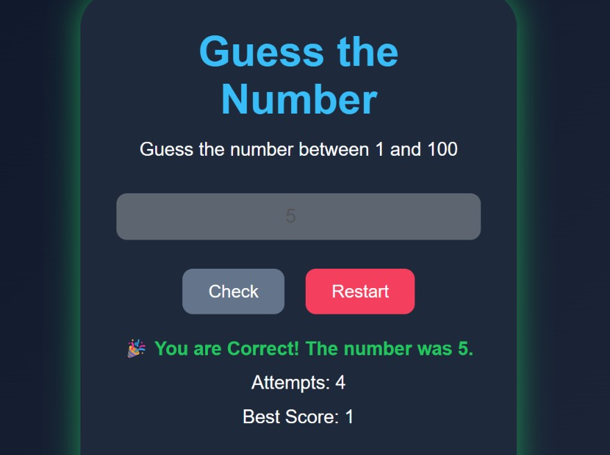
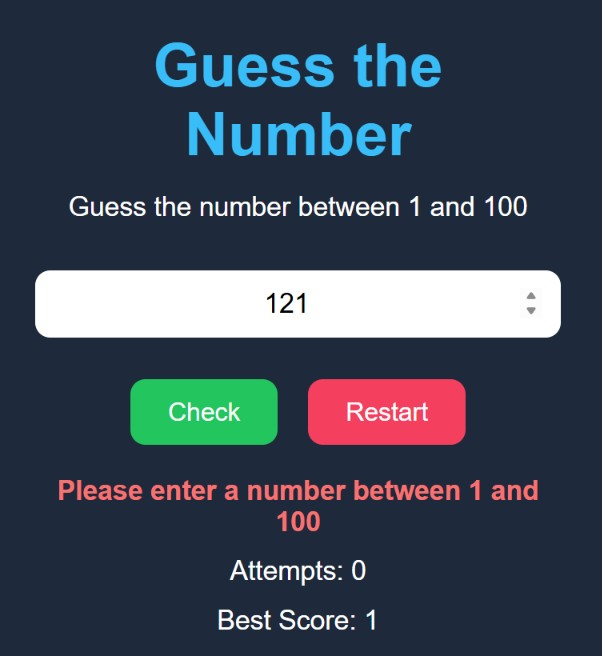

# 🎯 Number Guessing Game

A simple and interactive Number Guessing Game built using HTML, CSS, and JavaScript.

## Features

- 🎲 Random number generation (1–100)
- 🔢 Attempts counter
- 🏆 Best score tracking
- 💾 Best score saved using localStorage
- ⌨️ Press Enter to submit a guess
- 📜 Guess history (last 10 guesses)
- ✅ Input validation
- 🔄 Restart game
- 🎉 Winner animation and message

## Technologies Used

- HTML5
- CSS3
- JavaScript (ES6)

## Screenshots

### Home

### Winning

### Invalid Input

## How to Run

1. Download or clone the repository.
2. Open `index.html` in your browser.
3. Start guessing the number!

## Live Demo

🚀 **Play the game here:**

https://pavani-123161.github.io/Frontend-practice/Mini-Learning-Projects/number-guessing-game/